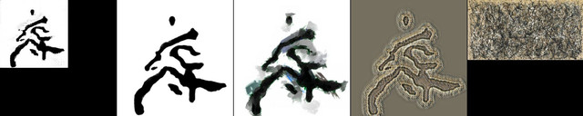
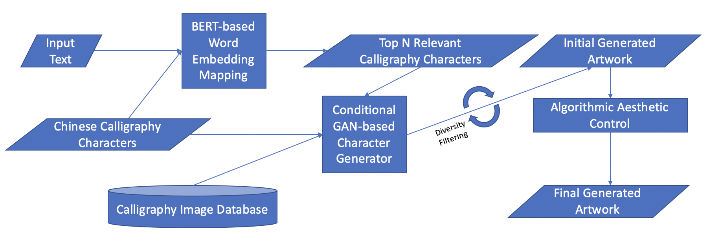
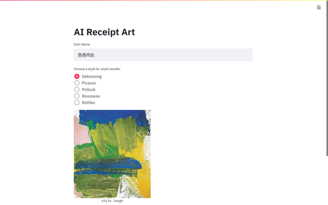

# A Framework and Dataset for Abstract Art Generation via CalligraphyGAN  

This is the code for the paper

**A Framework and Dataset for Abstract Art Generation via CalligraphyGAN**  
Jinggang Zhuo, Harry Jiannan Wang, Ling Fan  
Presented at [NeurIPS Workshop, Machine Learning for Creativity and Design](https://neurips2020creativity.github.io/).  

[paper]() | [demo](http://54.223.165.220:8501)  

We propose a creative framework based on Conditional Generative Adversarial Networks and Contextual Neural Language Model to generate artworks that have intrinsic meaning and aesthetic value.

Input a description in Chinese, and you can get a image representing these Chinese characters.  

<div align=center></div>

The whole framework is composed of 3 parts -- **CalligraphyGAN**, **Bert** and **Oil Painting**.  

<div align=center></div>

## Model

### CalligraphyGAN  

In this part, we use 1000 Chinese characters in [Chinese Calligraphy Dataset](https://github.com/zhuojg/chinese-calligraphy-dataset)
 as training data to train a generator.  
This generator is based on conditional GAN and take a 1000-dimensional vector as input. Each dimension in this 
vector represents the weight of each Chinese character in the data set.

### Bert  

>adapted based on https://github.com/huggingface/transformers  

In this part, we developed a simple algorithm based on BERT to map the input text with arbitrary number of characters into five characters from the 1000 characters used in GAN.

### Oil Painting  

>adapted based on by https://github.com/ctmakro/opencv_playground  

In this part, we convert generated image into oil painting.  

## Setup  

Follow the instructions, you can run web demo or train the model on your machine.  

### Using Docker  

Make sure you have Docker installed correctly, and pull the image by
```shell
docker pull zhuojg1519/calligraphy.ai
```
Source code and pretrained model are all included in this image.

### Setup on Local  

- Clone the repo and change directory to it

```shell
git clone https://github.com/harrywang/calligraphy.ai.git
cd calligraphy.ai
```

- Download checkpoint from [Google Drive](https://drive.google.com/drive/folders/1p7rDUKU_43WbdoKSE5iRKf2decnWTt-B?usp=sharing), 
and move files to `calligraphy.ai/ckpt`. So, the directory tree should be:  
```shell
...
├── ckpt
│   ├── ckpt-11.data-00000-of-00001
│   ├── ckpt-11.index
...
```

- Setup the virtual environment  
```shell
python3 -m venv venv
source venv/bin/activate
pip install -r requirements.txt
```

## Running Web Demo  

We use [Streamlit](https://www.streamlit.io/) to implement our web demo.  

- With docker, run the container and expose the port 8501.  

```shell
docker run -d -p 8501:8501 zhuojg1519/calligraphy.ai
```

- On local machine, run `st_demo.py` with Streamlit.  

```shell
streamlit run st_demo.py
```

Then visit `localhost:8501` to enjoy it.

<div align=center></div>

## Training Model

- Download 1000 characters we use from [Google Drive](https://drive.google.com/file/d/14xsoRphUO3YSFz6IwD8IKyeCfYNwonf8/view?usp=sharing),
and move files to `calligraphy.ai/data`. So, the directory tree should be:  
```shell
...
├── data
│   ├── chinese-calligraphy-1000.zip
...
```

- Unzip the dataset. Use `-O GBK` because the folder name is Chinese, and some OS cannot handle it correctly.  
```shell
unzip -O GBK chinese-calligraphy-1000.zip
```

Then

- With docker, specify COMMAND to train in the background, and use `docker logs` to print logs.  

> If you want to use GPUs on Linux, 
>make sure you have installed [NVIDIA Container Toolkit](https://github.com/NVIDIA/nvidia-docker).  

```shell
docker run -d -t -v `pwd`:/usr/src/calligraphy-ai --name="calligraphy.ai" zhuojg1519/calligraphy.ai python train.py
docker logs -f calligraphy.ai
```

- On local machine, run `train.py` to start training.  
```shell
python train.py
```

You can change training configuration in `models/calligraphyGAN_config.py`
