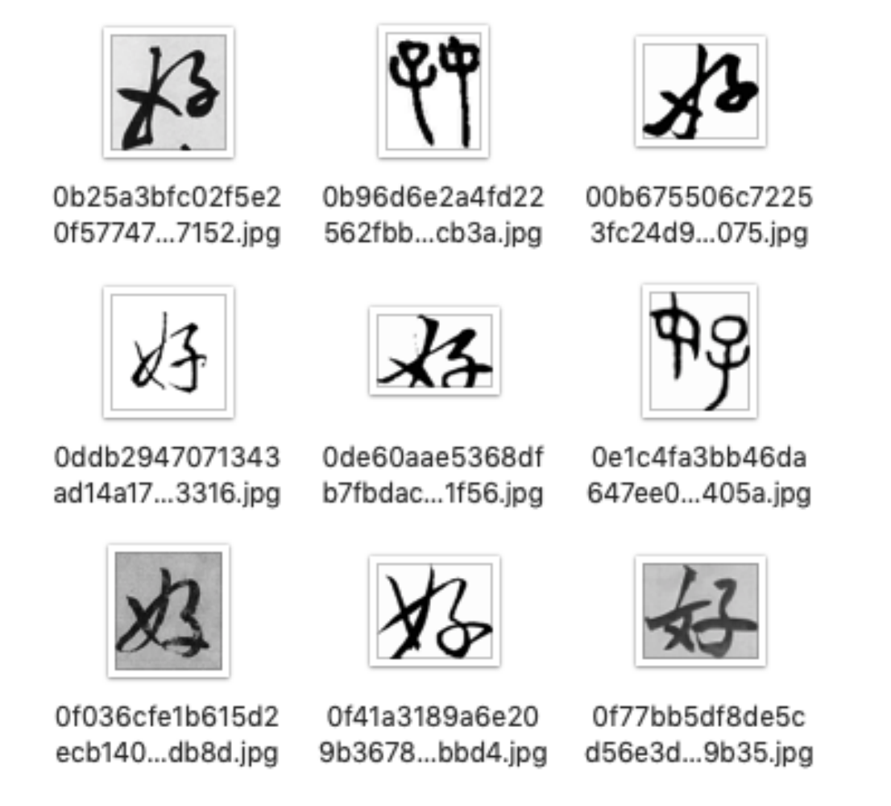
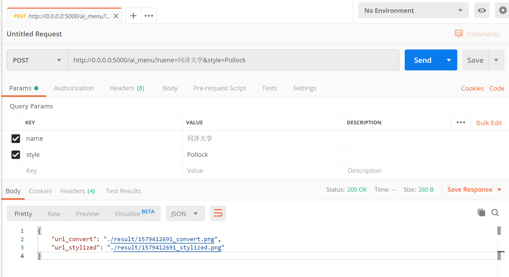
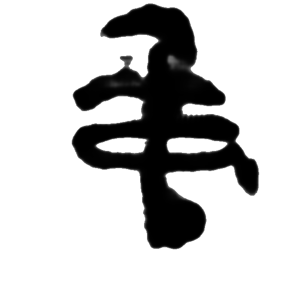
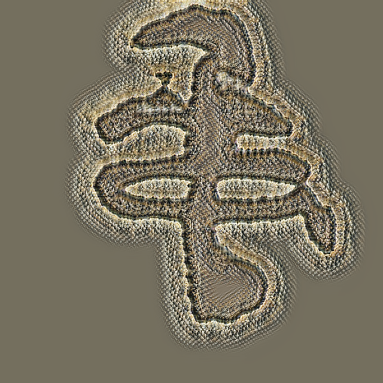

# Calligraphy + Food + AI

Beautiful Enough to Feast the Eyes 秀色可餐

## Introduction
This is the implementation of *Taming Generative Modeling and Natural Language Processing for Creative Customer Engagement*.  

This is a creative framework based on Conditional Generative Adversarial Networks and Contextual Neural Language Model to generate artworks that have intrinsic meaning and aesthetic value.

Input a dish name or description in Chinese, and we can get a image representing these Chinese characters.  

The whole framework is composed of 3 parts -- **Bert**, **CGAN** and **Oil Painting**.

### Dataset
We use 100 Chinese characters to test our framework.  

Examples from the dataset (Chinese character 好):  

### Bert
>adapted based on https://github.com/huggingface/transformers  

In this part, we developed a simple algorithm based on BERT to map the input text with arbitrary number of characters into five characters from the 100 characters.

### CGAN
In this part, we use 100 Chinese characters as training data to train a generator.  
This generator take a 100-dimensional vector as input,
and each dimension in this vector represents the weight of each Chinese character in the data set.

### Oil Painting
>adapted based on by https://github.com/ctmakro/opencv_playground  

In this part, we convert generated image into oil painting.

## Run Demo with Docker
We use docker to package our web demo and write `docker-compose.yml` to run our application.  
Just **make sure you have Docker Desktop installed correctly.**  
```shell script
docker run -t -p 8501:8501 --detach zhuojg1519/ai-recepit-art
```

>**Notice**:
If you already have image of this project (`zhuojg1519/ai-recepit-art`), make sure it is up to date or just remove it.
>* Check the list of docker images:
>```shell script
>docker images
>```
>* If you already have it, remove it by:
>```shell script
>docker rmi zhuojg1519/ai-recepit-art
>```

Then visit `http://localhost:8501` to enjoy the magic.  
<div align=center></div>


## Setup on Localhost
* Change to directory of ai-recepit-art
* Download checkpoint from https://drive.google.com/drive/folders/1W42ZRVCr3o2I_xwUNZFY_AQp4juUSahR?usp=sharing, and move files to ai-recepit-art/ckpt

Setup the virtual environment and folders:
```shell
python3 -m venv venv
source venv/bin/activate
pip install -r requirements.txt
mkdir result
mkdir ckpt
```

### Run the Demo
Make sure you are in the ai-recepit-art folder and virtual environment is activated and run `python demo.py`.

```
(venv) dami:ai-recepit-art harrywang$ python demo.py
initializing ......
2019-10-16 16:06:54.619176: I tensorflow/core/platform/cpu_feature_guard.cc:142] Your CPU supports instructions that this TensorFlow binary was not compiled to use: AVX2 FMA
2019-10-16 16:06:54.645629: I tensorflow/compiler/xla/service/service.cc:168] XLA service 0x7ff14eaea0a0 executing computations on platform Host. Devices:
2019-10-16 16:06:54.645649: I tensorflow/compiler/xla/service/service.cc:175]   StreamExecutor device (0): Host, Default Version
Enter dish name - [default:红烧肉卤鸡蛋]:
generating the character...
resizing and denoising the character...
[?] Choose a style:: Rousseau
   Picasso
   Pollock
  Rousseau
   Rothko
   deKooning

applying style transfer...
Finishing up...
```
Sample outputs. They are GAN result, result after noise reduction, result after oil painting,
result after style transfer and style image respectively.  


## Run and test the API
Run `python api.py` to start a Flask dev server to serve the API at localhost:5000, you can use Postman to test the API as follows:  
Add `params` as showed in picture (or add parameters using form-data), and post.  

* Finally you will get response with 2 fake urls, one for original image, one for stylized image.
* The result is stored in `ai-recepit-art/result`.  
* Here are some results:  
<div align=center></div>
<div align=center></div>

## Web Demo with Streamlit
We use [Streamlit](https://www.streamlit.io/) to build a demo to show our model.
* Make sure you are in directory of ai-recepit-art, you have installed all the requirements and you have downloaded checkpoints.  
```shell script
streamlit run st_demo.py
```
Now you can visit `localhost:8501` to enjoy it.
<div align=center></div>
